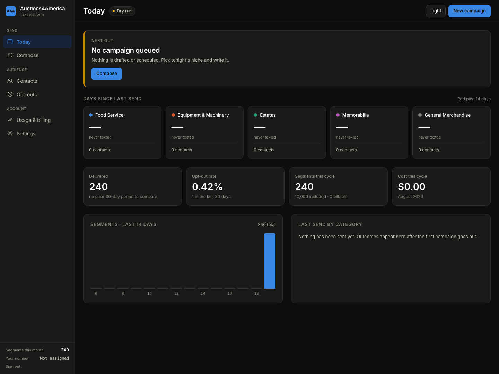
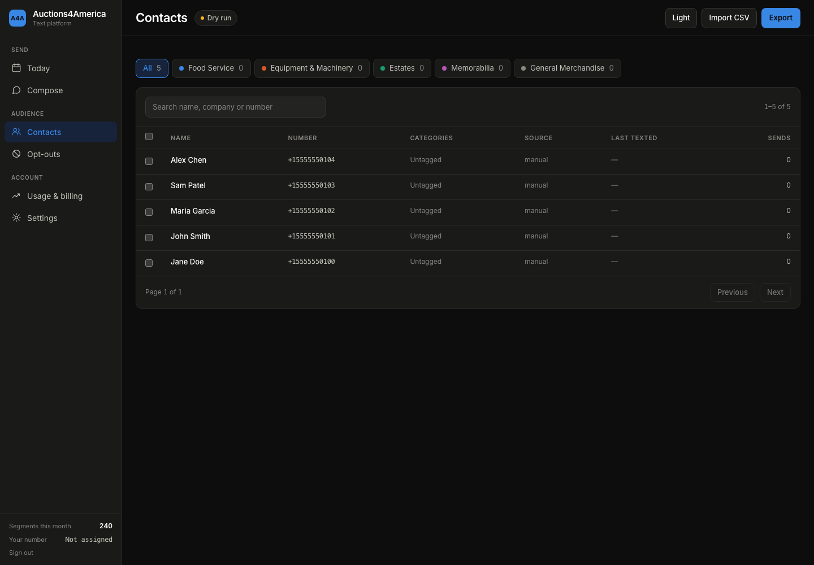
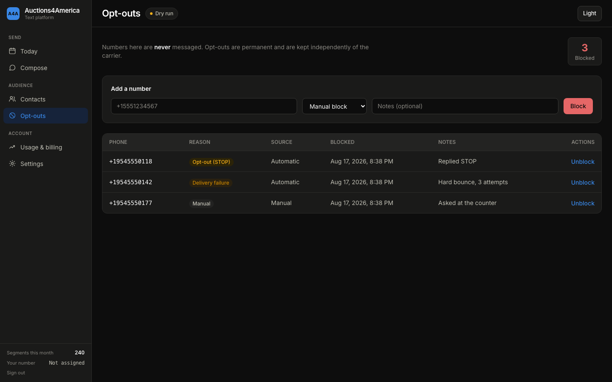
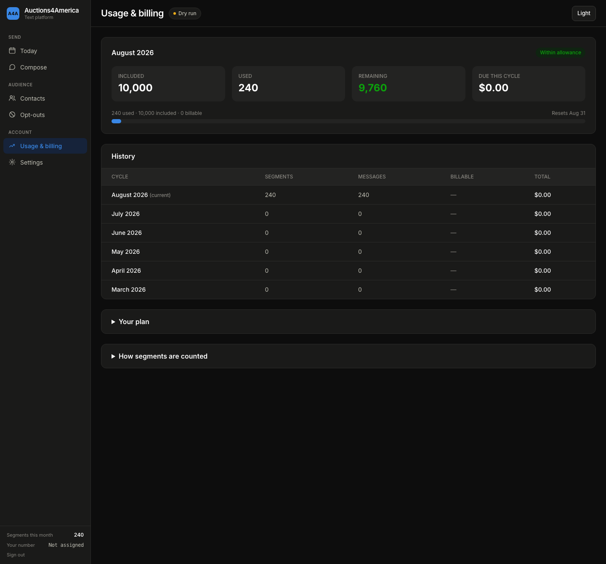
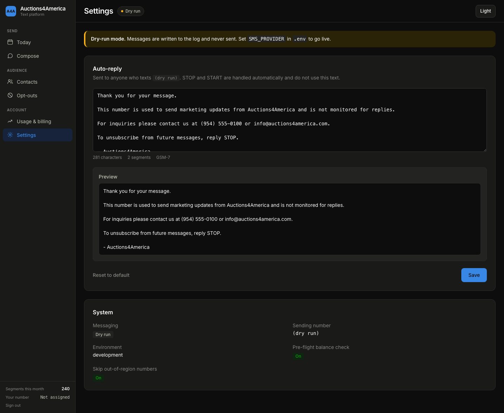
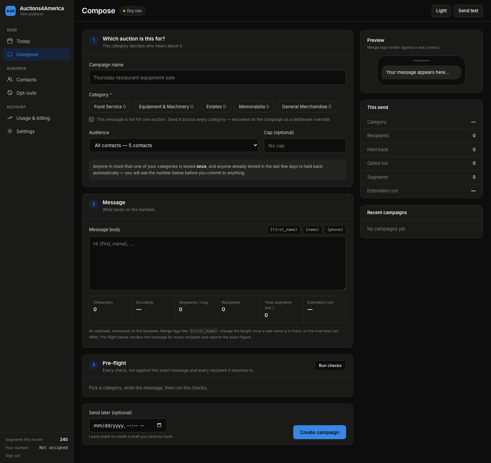

# Auctions4America — Text Marketing Guide

How to use the system, what it costs, and what to do when something looks wrong.

---

## Signing in

Go to your site address and sign in with the username and password we set up
together. The session lasts a week on the same browser, so you will not be asked
every day. If you ever want to force everyone out, tell us and we rotate the key.

Nothing in the system is reachable without signing in. There is no public page
other than the sign-in screen itself.

---

## The six screens

The menu down the left is grouped the way the work actually happens: **Send**,
then **Audience**, then **Account**.

### Today

The short version of everything: what is going out today, what went out
recently, how many contacts you have, and how much of this month's allowance you
have used. Start here.

### Compose

Where you write and send. Covered in its own section below.

### Contacts

Your buyer list. Search it, filter it by category, and upload to it.

Upload a CSV and the system matches the columns to the fields it needs, cleans
up the phone numbers, and throws away duplicates. Someone who appears in five
different files still enters your list once.

**Uploading is two steps on purpose.** You pick the category first, then you see
exactly what the file will do — how many are new, how many you already have, how
many are already in that category, how many have opted out, and how many rows
have no usable number — *before* anything is saved. Check those counts against
the file. A CSV whose phone column was not recognised imports nothing and looks
exactly like a successful import of an empty file, and that preview is where you
catch it.

If a commit turns out wrong, an upload can be undone. It removes only what that
upload added.

### Opt-outs

Everyone who has told you to stop. You cannot text these people again, and that
is deliberate. You can also add a number here by hand — if someone asks you at
the counter, put them in.

### Usage & billing

Segments used this cycle against the 10,000 included, what you owe if you have
gone past it, and the same figures for previous months.

### Settings

Your auto-reply — what gets sent to anyone who texts your number back — plus
your sending number and how the system is configured.

---

## Sending a campaign

The screen is three numbered steps, and they are in that order for a reason.

### 1. Which auction is this for?

Pick the category first. **The category decides who hears about it.** This is the
one that prevents the expensive mistake: last night's fryer text, edited in a
hurry, sent to tonight's memorabilia list.

Then choose the audience, and a cap if you want one. Two things happen
automatically and you will see both before you commit:

- Someone in more than one of your categories is texted **once**, not once per
  category.
- Anyone texted in the last few days is **held back**, so nobody gets two
  messages in a row.

If a message genuinely is for everybody, there is a tick-box for that. It is
recorded on the campaign as a deliberate override rather than something you can
do by accident.

### 2. Message

Type it. The panel on the right shows it as a phone would, rendered against a
real contact from your list — so a merge tag that is empty for half the list
shows up here rather than on 6,000 handsets.

The counter row under the box gives you characters, encoding, segments and an
estimated cost as you type. It says **estimate** because it measures what you
typed: `{first_name}` is twelve characters in the box and a name once it is sent.

### 3. Pre-flight

Press **Run checks**. This is the one to actually read.

It runs the message against your exact audience and reports:

- whether the account can fund the whole send
- whether the message says how to opt out
- whether it names your business in the opening
- how long it is
- **what it really costs** — the message rendered for every single recipient and
  added up, not an estimate. If someone's name pushes their message over a
  segment boundary, it tells you, and the total it gives you is the true one.
- how many people are being held back as recently texted
- whether it contains a link shortener the phone networks will quietly drop
- whether the wording sounds like a different category from the one you picked

Then create the campaign — either to send by hand, or scheduled for later.

The system works through the list steadily rather than all at once, which is
what keeps your number in good standing with the phone networks. You can watch
it go out in real time. If something is badly wrong — too many failures in a row
— the campaign stops itself rather than burning through your whole list.

### Before it sends, it checks it can finish

The system will refuse to start a campaign it cannot afford to complete. This is
on purpose. The alternative is what happens on other platforms: a send stops
halfway, four thousand people get nothing, and you have no clean way to work out
who did and did not receive it. Better to be told "not yet" up front.

### The "Dry run" badge

Next to the page title at the top there is a small badge reading either **Dry
run** or **Live**.

**Dry run** means campaigns are written down but not actually sent. That is the
mode we use while setting up, and while you are learning the screens — you can
click anything without consequence.

**Live** means messages go to real handsets.

If you ever wonder "did that campaign actually go out?", that badge is the
answer.

---

## Segments, and why emoji are expensive

Texts are billed in **segments**, not messages. A plain-text message is one
segment up to 160 characters. Go over that and it becomes two segments, then
three, and so on.

**Adding a single emoji changes the maths.** One emoji anywhere in the message
drops the limit from 160 characters to 70 — so a message that was one segment
becomes three, and costs three times as much to send to the same people. The
composer warns you when this happens, in dollars, at tonight's recipient count.
It is not a bug; it is how the phone networks encode text, and it applies
everywhere.

**Names change the length too.** If you write "Hi {first_name}", the message that
reaches Al is shorter than the one that reaches Christopher, and occasionally
that difference is enough to tip one of them into a second segment. The counter
as you type cannot know that — it is measuring what is in the box. **Pre-flight
can**, because by then it knows exactly who is getting it, and the total it
reports is the real one.

If you want the emoji, use it. Just know that on a 5,000-person send, one emoji
is the difference between 5,000 segments and 15,000.

### Practical version

- Keep it under 160 characters and you pay for one segment per person.
- Write "and" instead of "&" — no difference in cost, but it reads better.
- An emoji roughly triples the cost of the send. Decide if it earns it.

---

## What it costs

- **No monthly fee.**
- **10,000 segments included every month.**
- **$0.015 per segment** after that.

The **Usage** screen shows where you are against the 10,000 for the current cycle
and what, if anything, you owe. Those are the live numbers — this document just
repeats the agreement.

For scale: a one-segment message to 8,000 people uses 8,000 segments and stays
inside the included allowance. The same message with an emoji uses 24,000, and
the 14,000 past the allowance would come to $210.

---

## Opt-outs

When someone replies STOP, they are removed immediately and automatically. The
same goes for UNSUBSCRIBE, CANCEL, QUIT, END, and a handful of other phrasings —
people do not always type the exact word, and the system reads intent rather than
demanding an exact match.

Three things worth knowing:

1. **It is instant.** No overnight sync, no window where they might get one more.
2. **It cannot be undone from your side.** If someone opts out by mistake, they
   have to text START themselves. This is a legal requirement, not a limitation
   we chose, and it protects you.
3. **Uploading a new CSV does not bring them back.** If someone who opted out
   appears in a file you upload later, they stay opted out. This is the single
   most common way businesses get themselves into trouble, and the system will
   not let it happen.

Every outgoing message includes opt-out wording. That is also a legal
requirement.

---

## When something looks wrong

**A message failed to send.** Most failures are the number itself — disconnected,
or a landline that cannot receive texts. The campaign view groups failures by
reason so you can see at a glance whether it is a handful of bad numbers or
something broader.

**Numbers you scraped or bought mostly fail.** Business numbers from directories
are usually landlines. The system filters those out before sending rather than
paying to text a fax machine, which is why an imported list often shows fewer
sendable contacts than rows in the file.

**Delivered vs sent.** "Sent" means it left the system. "Delivered" means the
handset confirmed it. Some carriers never send confirmation, so a message can be
genuinely delivered and still show as sent. You are only billed once per segment
either way.

**Nothing is going out at all.** Check the badge at the top of the screen. If it
reads **Dry run**, campaigns are being written down rather than sent — that is
the mode we use while setting up. If it reads **Live** and messages still are not
arriving, call us.

---

## Your data

Your contact list is backed up every night, and the backup is checked by
restoring it — not just written and assumed good. If the server were lost
entirely, your list is recoverable.

We do not share your list, and it is not pooled with anyone else's.

---

## Getting help

Call or text us. If it is about a specific campaign, mention the campaign name
and roughly when you sent it — that is enough for us to find it.
